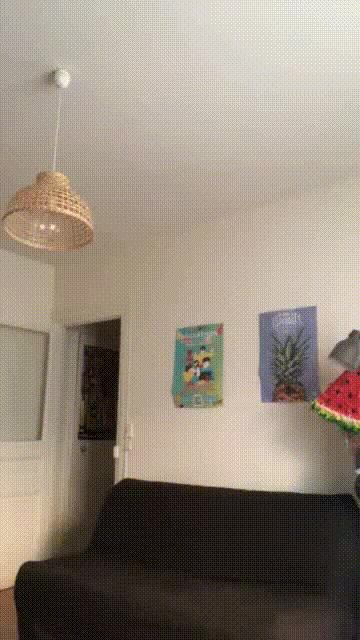
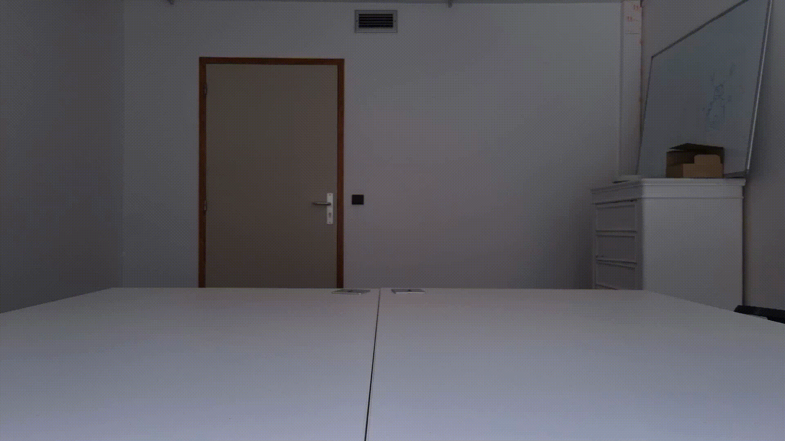

# GPU 

## AUTHORS
Baptiste Bourdet \<baptiste.bourdet@epita.fr\> \
Hugo Moreau \<hugo.moreau@epita.fr\> \
Philippe Bernet \<philippe.bernet@epita.fr\> \

---

The objective of this project is to set up a **pipeline** to detect **objects** in multiple images looking for differences with a reference image. \

The pipeline computes the following steps: \
- greyscale the input image
- smooth the greyscaled image using a gaussian kernel
- compute the difference between the smoothed image and the smoothed image of the greyscaled reference image (the reference image is the same for all the images)
- compute an opening and then a closing with the output of the previous step
- binarize the output of the previous step
- compute the connected components and their bouding box of the binarized image

<p float="left">
    
    
    
</p>

---

## Build

```bash
mkdir build
cd build
cmake .. -DCMAKE_BUILD_TYPE=Release
```

It is possible to build everything with the following command: \

```bash
make -j
```

It is also possible to build the executable separately :

```bash
make main
make test
make bench
```

## Main

The program can be used as follows: \

```bash
Usage: ./main [OPTIONS] -- REFENCE_IMAGE_PATH ([IMAGE_PATH]*|DIRECTORY_PATH)
```

Note that the dashs are mandatory. \

The program will then output on standard output a json with the following format \

```json
{
    "image_1": [
        [x1_1, y1_1, w1_1, h1_1],
        ...
        [x1_N, y1_N, w1_N, h1_N]
    ],
    ...
    "image_M": [
        [xM_1, yM_1, wM_1, hM_1],
        ...
        [xM_N, yM_N, wM_N, hM_N]
    ]
}
```

To know possible parameters of the program, you can use the following command: \

```bash
./main --help
Usage: ./main [OPTIONS] -- REFENCE_IMAGE_PATH ([IMAGE_PATH]*|DIRECTORY_PATH)

        --binary_threshold (value:12)
                Minimum value for a pixel to be considered as a binary pixel
        --folder (value:false)
                Is the path a folder
        -h, --help (value:false)
                show help message
        --kernel_size (value:5)
                Size of the kernel for the gaussian blur
        --kernel_size_closing (value:41)
                Should be odd
        --kernel_size_opening (value:101)
                Should be odd
        --minimum_pixel_percentage (value:1.0)
                Percentage of the space occupied by the object to be considered as a detection
        --mode (value:0)
                0:CPU 1:GPU1 2:GPU2 3:GPU3 4:GPU4 5:GPU5 6:GPU6
```

---

## Test

Test are only performed on the CPU version of the program. \
Tests are done with Google Test and can be executed with the following command: \

```bash
./test
```

---

## Bench

Benchmarks are done with Google Benchmark.

### Unit

The unit benchmark displays performances of the element of the pipeline (on *Nuits Blanches* image). \
Unit benchmark can be performed as follow: \

```bash
42sh$ ./bench_unit
----------------------------------------------------------------------------
Benchmark                                  Time             CPU   Iterations
----------------------------------------------------------------------------
BM_Greyscale/real_time                 0.400 ms        0.400 ms        10000
BM_Blur/real_time                       1.57 ms         1.57 ms        10000
BM_Diff/real_time                      0.238 ms        0.238 ms        10000
BM_Closing_Opening/real_time            18.0 ms         18.0 ms           38
BM_Threshold/real_time                 0.171 ms        0.171 ms        10000
BM_Connectic_components/real_time       21.4 ms         21.4 ms           33
```

Only the computating time is concidered. \

## Full

The full benchmark displays performances of the complete for multiple version. \
Full benchmark can be performed as follow: \

```bash
42sh$ ./bench
-------------------------------------------------------------------------------------------------------------------
Benchmark                                                         Time             CPU   Iterations UserCounters...
-------------------------------------------------------------------------------------------------------------------
BM_Detection_file_nb/nuits_blanches_cpu/real_time              8786 ms         8785 ms            1 items_per_second=0.113823/s
BM_Detection_file_nb/nuits_blanches_gpu_one/real_time          1663 ms          666 ms            1 items_per_second=0.601193/s
[...]
BM_Detection_file_nb/nuits_blanches_gpu_five/real_time          116 ms          111 ms            6 items_per_second=8.65792/s
BM_Detection_folder_nb/nuits_blanches_gpu_one/real_time       31876 ms        31370 ms            1 items_per_second=2.5411/s
[...]
BM_Detection_folder_nb/nuits_blanches_gpu_five/real_time       3725 ms         3721 ms            1 items_per_second=21.7461/s
```

The data loading is not considered. \

---

# Video maker

A video maker is also available to make a video of the detection of objects in the images. \

```bash
./main [OPTIONS] -- REFENCE_IMAGE_PATH ([IMAGE_PATH]*|DIRECTORY_PATH) | python video_maker.py [-o output.avi] [-f FPS]
```

--- 

## Parameters used for gifs

### Nuits Blanches

```bash
--binary_threshold=10 --high_pick_threshold=20 --kernel_size_opening=41 --kernel_size_closing=21 --minimum_pixel_percentage=0.5
```

### Scia Premium

```bash
--binary_threshold=40 --high_pick_threshold=40 --kernel_size_opening=21 --kernel_size_closing=15 --minimum_pixel_percentage=5
```

### Aled

```bash
--binary_threshold=20 --high_pick_threshold=40 --kernel_size_opening=21 --kernel_size_closing=15 --minimum_pixel_percentage=1
```
